<p  align="center">

<h1  align="center">DREAMSAPP</h1>

</p>

<p  align="center">

<em>Un moyen d'enregistrer ses rêves !</em>

</p>

<p  align="center">


<p>

<p  align="center">

<em>Developpé avec les outils ci-dessous :</em>

</p>

<p  align="center">


</p>

<hr>

  

## Liens rapides

  

>  - [ Introduction](#-introduction)

>  - [ Fonctionnalitées](#-features)

>  - [ Prérequis & Installation](#-prerequis)

>  - [ Structure](#-structure)

>  - [ Modules](#-modules)

>  - [ Screenshots](#-screenshots)
  

---

  

## Introduction

  

Le projet Dream Journal est développé en utilisant React Native, qui permet de créer des applications mobiles multiplateformes en utilisant du JavaScript. Les principaux langages utilisés dans ce projet sont JavaScript et TypeScript, avec une utilisation répandue de JSX pour la création des composants d'interface utilisateur.

Un élément clé de l'architecture de ce projet est l'utilisation d'AsyncStorage. AsyncStorage est une API de stockage de données persistantes et asynchrones disponible dans React Native. Dans ce projet, AsyncStorage est utilisé pour stocker les données des rêves de l'utilisateur de manière persistante sur l'appareil mobile. Cela permet de sauvegarder les rêves enregistrés même lorsque l'application est fermée ou que l'appareil est redémarré.

L'utilisation d'AsyncStorage permet une expérience utilisateur fluide et cohérente en conservant les données des rêves accessibles et consultables à tout moment, sans avoir besoin d'une connexion réseau. Cela garantit également la confidentialité des données de l'utilisateur, car les données sont stockées localement sur l'appareil et ne sont pas partagées avec des serveurs externes.


---

  

## Fonctionnalitées

  

L'appli offre plusieurs fonctionnalités pour aider les utilisateurs à enregistrer, gérer et explorer leurs rêves. Voici un aperçu des principales fonctionnalités implémentées dans l'application :

1.  **Enregistrement de rêves :** Les utilisateurs peuvent enregistrer les détails de leurs rêves en remplissant un formulaire intuitif. Le formulaire comprend des champs pour le titre du rêve, sa description, des catégories, des étiquettes custom, etc.
    
2.  **Analyse de texte de rêve :** L'application utilise l'API MeaningCloud pour analyser le texte de description des rêves enregistrés. Cette analyse permet de détecter des concepts clés, des expressions monétaires et des citations potentielles dans le texte du rêve.
    
3.  **Exploration du journal de rêves :** Les utilisateurs peuvent parcourir leur historique de rêves enregistrés dans l'application. Chaque rêve enregistré est présenté sous forme de "carte de rêve", affichant toutes les informations disponibles sur ce rêve.
    
4.  **Gestion des rêves :** Les utilisateurs ont la possibilité de supprimer des rêves de leur historique ou de tout réinitialiser.
    
5.  **Recherche & tri :** L'application propose une fonction de recherche qui permet aux utilisateurs de rechercher des rêves en fonction de leur titre, de leur description, mais aussi de trier en fonction de la date, de leur ajout et des catégories qui sont associées.
    
6.  **Notifications :** L'application envoie des notifications pour informer les utilisateurs chaque fois qu'un nouveau rêve est enregistré avec succès. De plus, une notification est envoyée une heure après l'enregistrement du dernier rêve, encourageant ainsi les utilisateurs à enregistrer régulièrement leurs rêves.
    
8.  **Documentation :** Une documentation sur les différents types de rêves est disponible afin de donner des explications aux rêves des utilisateur.
  

---

  ## Prérequis & Installation

Avant d'installer et d'utiliser l'application, assurez-vous d'avoir les prérequis :

#### Prérequis

-   [Node.js](https://nodejs.org/en) installé sur votre système
-   Un émulateur Android ([Android Studio](https://developer.android.com/studio) - **pixel 7 - api 33**) ou Expo Go sur votre téléphone pour tester l'application

#### Installation

1.  Clonez le dépôt GitHub de l'application Journal de rêves sur votre machine locale :
    
    
    `git clone https://github.com/aaminesbai/DreamsApp.git` 
    
2.  Accédez au répertoire de l'application :
        
    `cd DreamsApp` 
    
3.  Installez les dépendances du projet à l'aide de npm :
        
    `npm install` 
    
 3.  Indiquez votre clé API MeaningCloud obtenable facilement sur leur [site web](https://www.meaningcloud.com/developer/login) dans le fichier API_CONFIG :
        
    `// Ici, mettez votre clé MeaningCLOUD  
    export const API_KEY = "CHANGER_PAR_VOTRE_CLE_API"` 

#### Utilisation

1.  Assurez-vous que votre émulateur Android est en cours d'exécution ou installez Expo Go.
    
2.  Démarrez l'application en utilisant Expo en tapant la commande suivante dans PowerShell ou CMD :
        
    `npx expo` 
    
6.  Une fois que tout est lancé, vous pouvez choisir de lancer l'application sur votre émulateur Android en appuyant sur la touche "a" dans la fenêtre du terminal ou de scanner le code QR avec l'application Expo sur votre appareil pour lancer l'application dessus.
    
7.  L'application devrait maintenant être prête sur votre émulateur ou votre appareil, prête à enregistrer vos rêves et à explorer votre historique de rêves.

## Structure

  

```sh

└──  DreamsApp/

├──  API_CONFIG.js

├──  README.md

├──  app

│  ├── (tabs)

│  │  ├──  _layout.tsx

│  │  ├──  index.tsx

│  │  ├──  three.tsx

│  │  └──  two.tsx

│  ├──  +html.tsx

│  ├──  +not-found.tsx

│  ├──  _layout.tsx

│  └──  modal.tsx

├──  app.json

├──  assets

│  ├──  fonts

│  │  └──  SpaceMono-Regular.ttf

│  └──  images

│  ├──  adaptive-icon.PNG

│  ├──  favicon.PNG

│  ├──  icon.PNG

│  └──  splash.PNG

├──  babel.config.js

├──  components

│  ├──  DreamDoc.tsx

│  ├──  DreamForm.tsx

│  ├──  DreamList.tsx

│  ├──  EditScreenInfo.tsx

│  ├──  ExternalLink.tsx

│  ├──  StyledText.tsx

│  ├──  Themed.tsx

│  ├──  __tests__

│  │  └──  StyledText-test.js

│  ├──  categories.tsx

│  ├──  useClientOnlyValue.ts

│  ├──  useClientOnlyValue.web.ts

│  ├──  useColorScheme.ts

│  └──  useColorScheme.web.ts

├──  constants

│  └──  Colors.ts

├──  package-lock.json

├──  package.json

└──  tsconfig.json

```

  

---

  

## Modules

  

| File                                                                                       | Summary                                    |
| ---                                                                                        | ---                                        |
| [API_CONFIG.js](https://github.com/aaminesbai/DreamsApp/blob/master/API_CONFIG.js) | HTTP error 429 for prompt `API_CONFIG.js` |
| [**/constants**](https://github.com/aaminesbai/DreamsApp/blob/constants/) |  Ce dossier contient uniquement le fichier /Colors.ts qui contient les mélanges de couleurs qui seront utilisés pour styliser nos pages. |
| [**/components** :](https://github.com/aaminesbai/DreamsApp/blob/master/components/) | Ce dossier contient tous nos composants TSX utilisés dans les pages, ainsi que des fichiers TypeScript contenant des fonctions utilisées pour le style ou pour le serveur. |
| [**/components/_tests_/** ](https://github.com/aaminesbai/DreamsApp/blob/master/components/_tests_/) | Ce dossier contient tout ce qui est lié aux tests. |
| [**/assets** :](https://github.com/aaminesbai/DreamsApp/blob/master/assets/) | Ce dossier contient les ressources statiques utilisées dans l'application. |
| [**/app**](https://github.com/aaminesbai/DreamsApp/blob/master/app/) | Ce dossier contient les pages principales de l'application. |
| [**/app/(tabs)**](https://github.com/aaminesbai/DreamsApp/blob/master/assets/images/) | Ce dossier contient essentiellement les pages de l'application. index.tsx est la première page et two.tsx est la seconde. layout.tsx est la barre de navigation inférieure. |
| [**/app/**](https://github.com/aaminesbai/DreamsApp/blob/master/app/) | Il contient d'autres pages qui ne sont pas les "pages principales" référencées dans la barre de navigation, telles que les modèles ou la page "introuvable". Il contient également des fichiers spécifiques au web et un fichier qui traite du modèle de mise en page dans ./(tabs). |

 ## Screenshots

Rédiger un rêve:

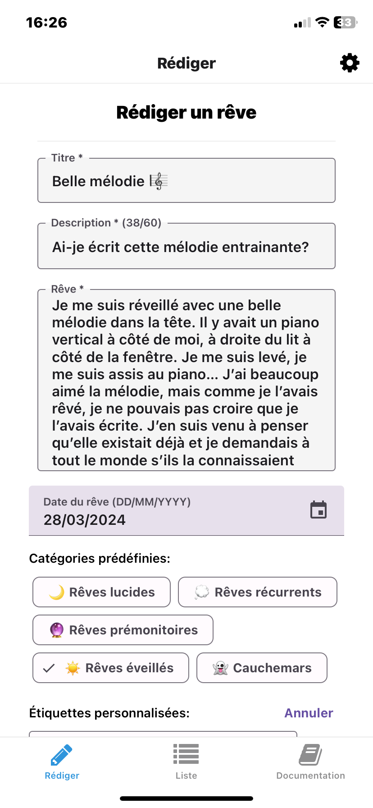
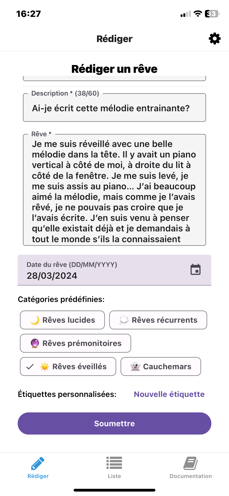

Etiquettes personnalisables:

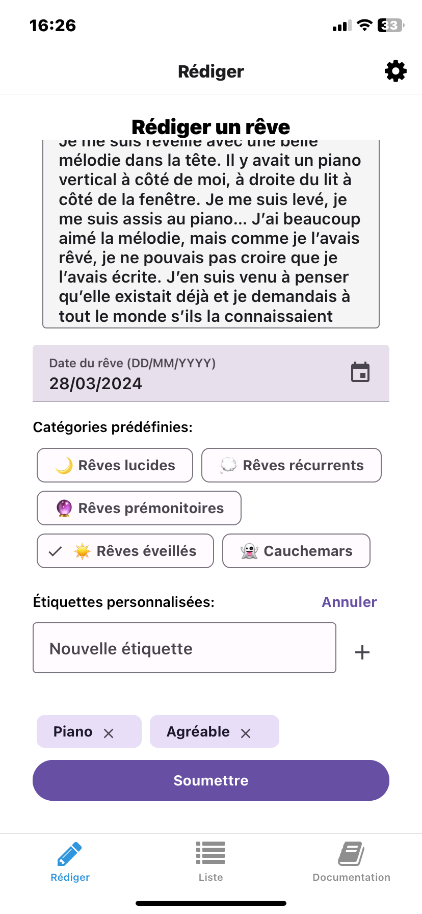

Choix de la date du rêve:

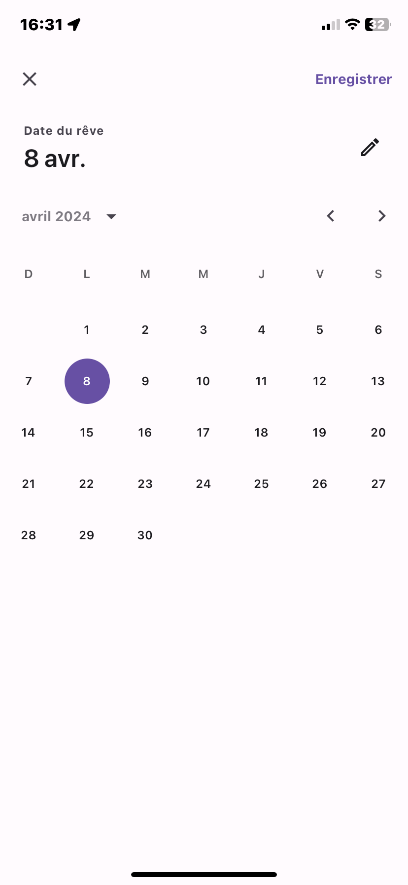

Rêve envoyé:

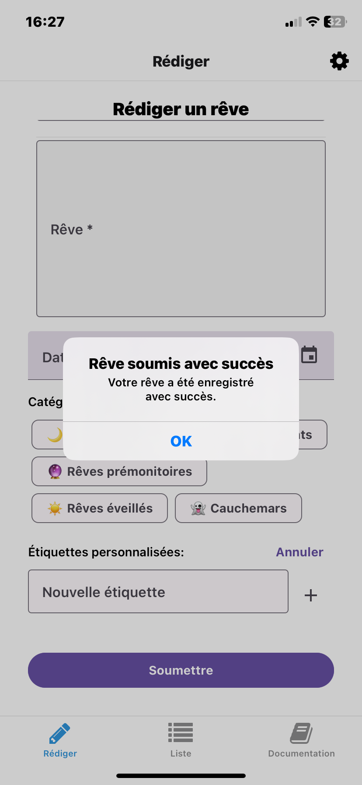

Liste des rêves:

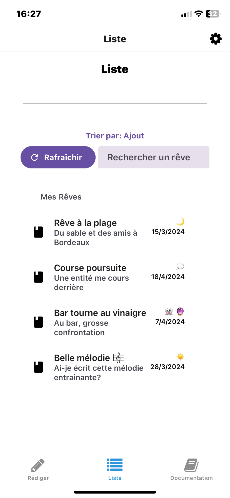

Détails d'un rêve:

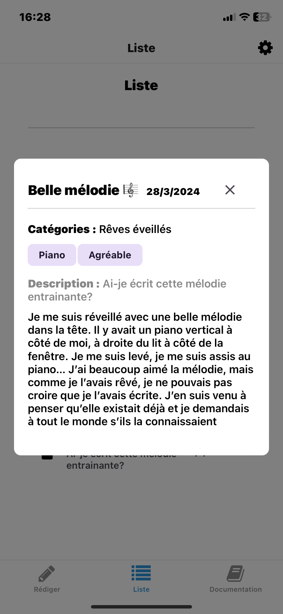
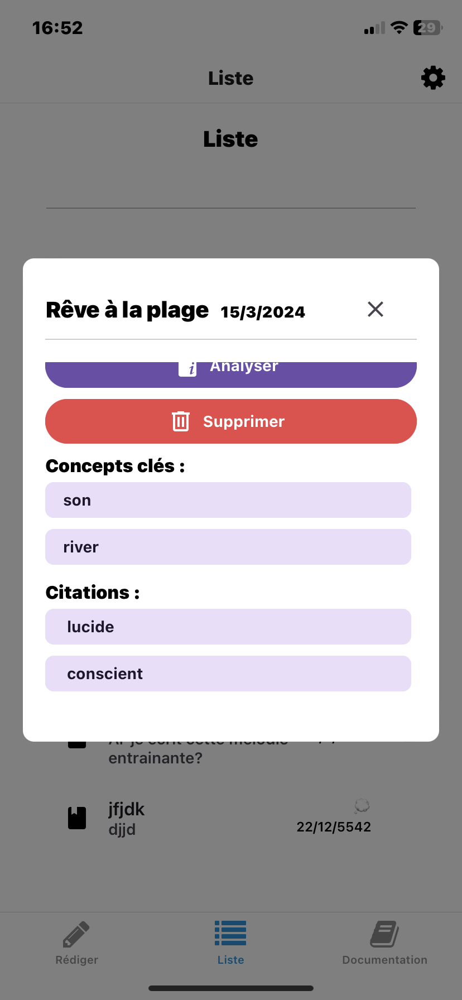

Supression d'un rêve:

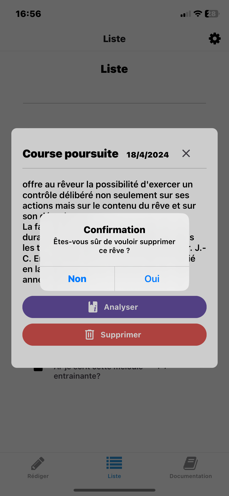
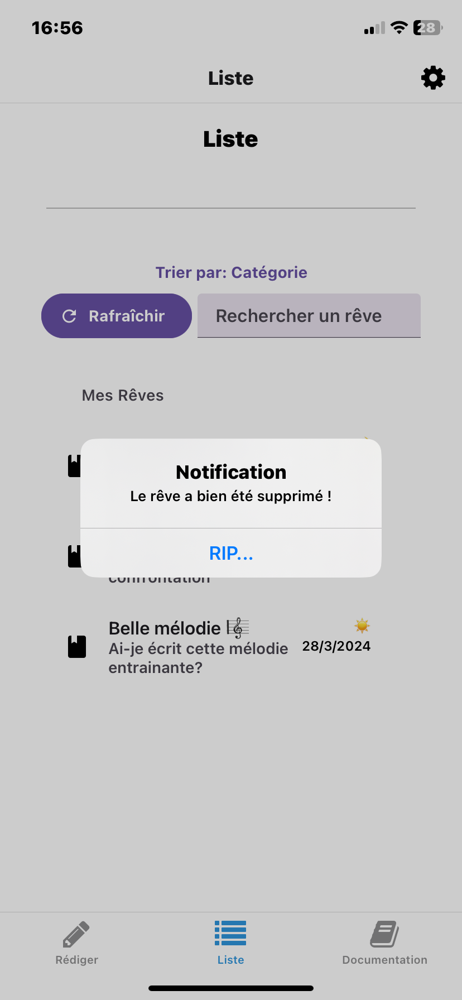

Recherche par mot:

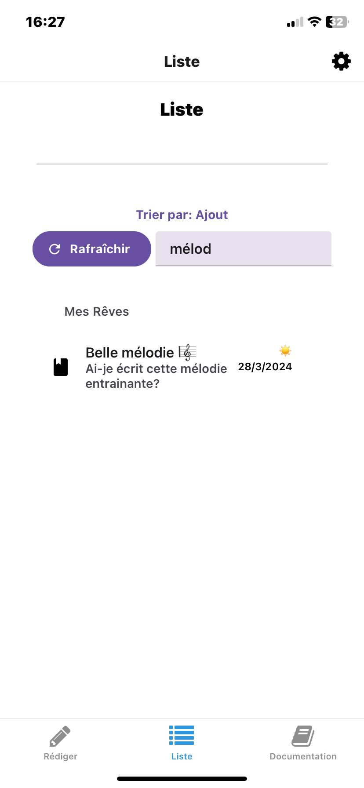

Options de tri:

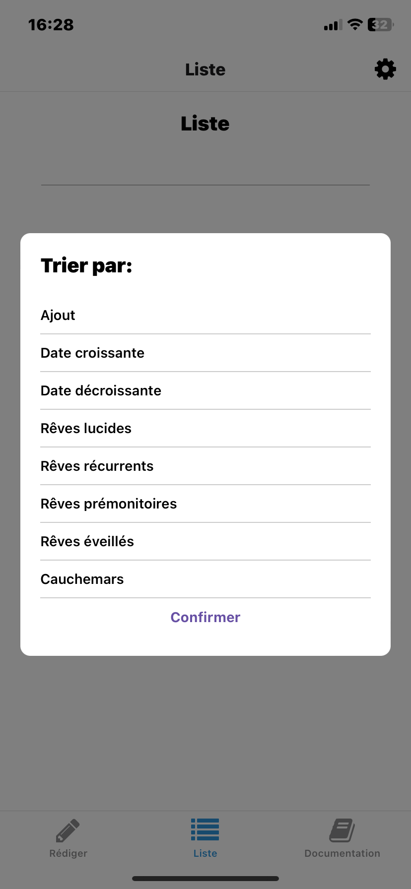

Tri par date croissante:

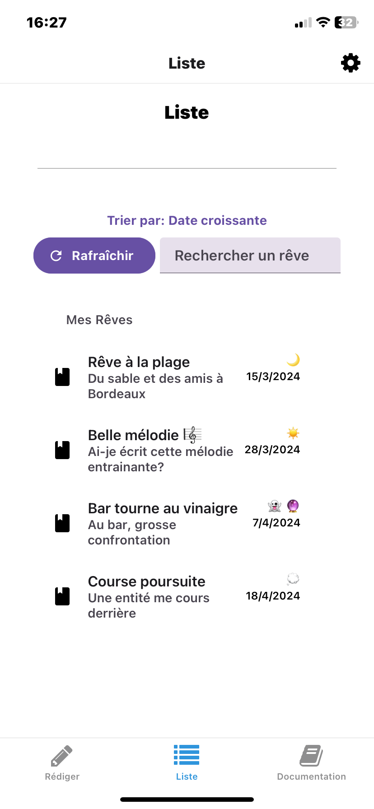

Tri par date décroissante:

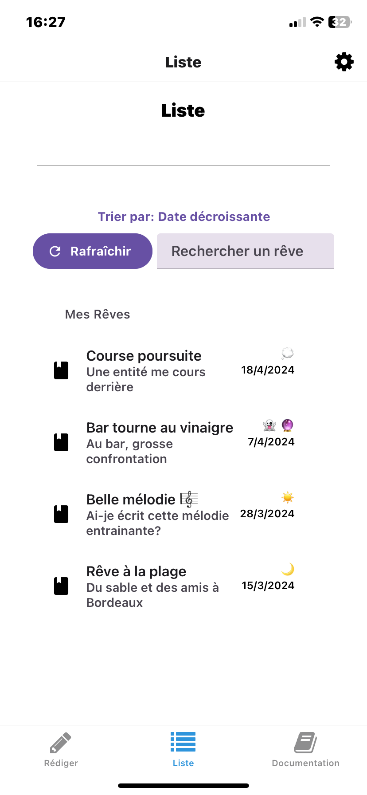

Documentation:

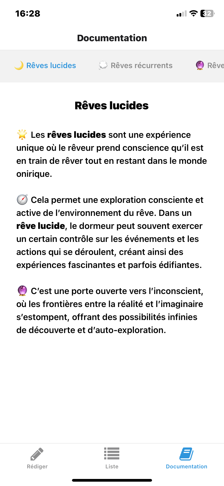
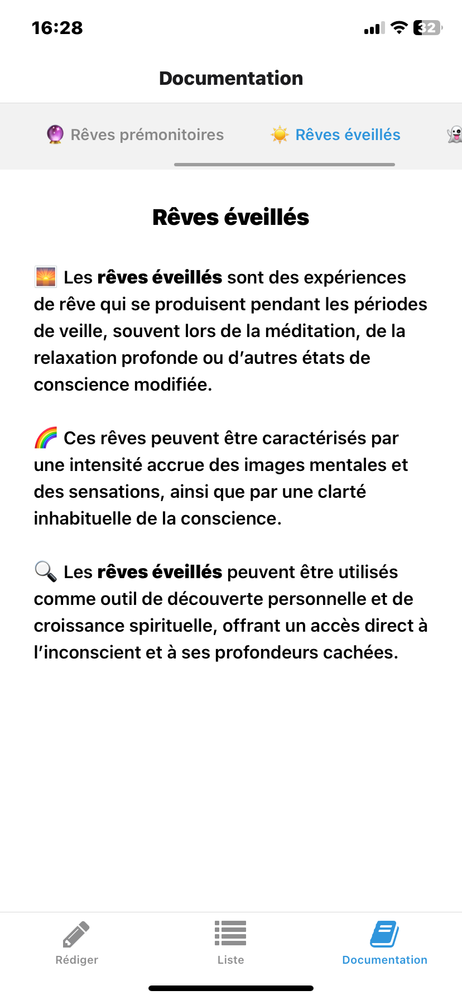
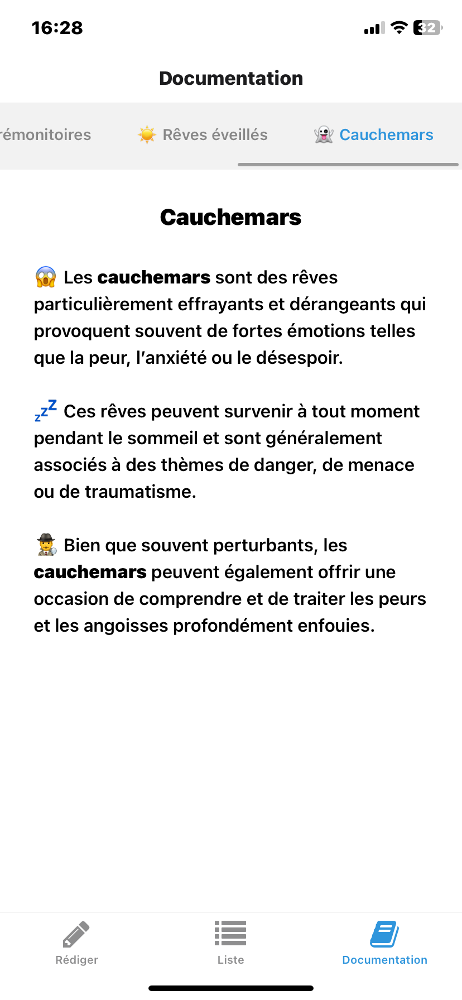

Paramètres:


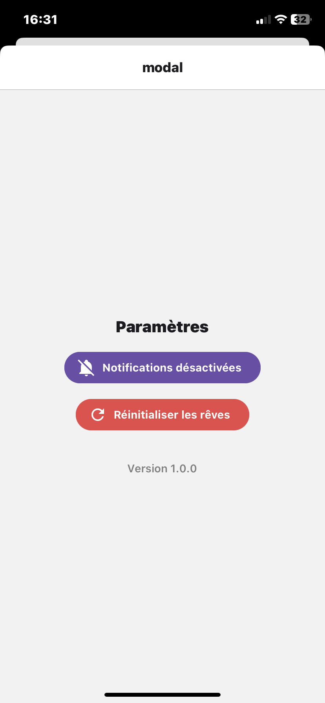
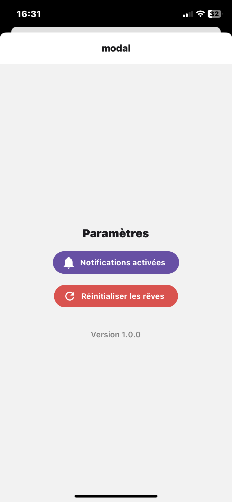
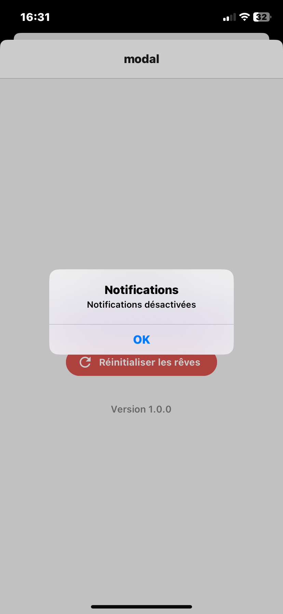


